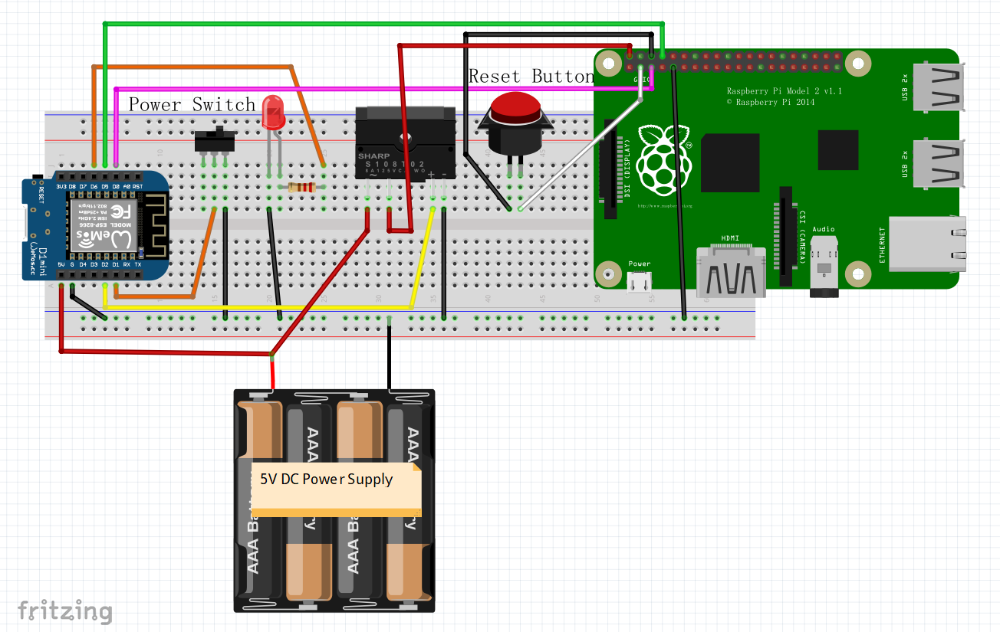

## The Purpose of this Project
[Recalbox](https://www.recalbox.com/) has done a great job bringing us a powerful yet easy-to-use emulator.  I have already made a bar top arcade
 with it and loved it a lot.
 
This time I'd like to retrofit a Nintendo Famicom (aka. NES) game console with a spared RPI2 and I want to make it
feel as authentic as possible, for example: the power on and off is handled by the original power switch,
and I don't need to worry about RPI being properly shutdown; also I can reset the game or quit the game to 
choose another one by pressing the original reset button, rather than using the combined key press on the gamepad
which is not the way how a real Famicom works.

So what I do is to use a spared WeMos D1mini (ESP8266) to handle the original power switch and SSR etc, and the ESP8266
will send signals to GPIOs on RPI to either reset/quit games or shutdown the Linux system safely, so that I won't
be bothered by the Recalbox menus, all the necessary operations are just like the good old days.


## Bill of Materials
* 1 x WeMos D1mini or other ESP8266 dev board
* 1 x RPI2 with [Recalbox](https://www.recalbox.com/) installed
* 1 x DC-DC Solid State Relay (make sure it can be triggered by 3V)
* 1 x 3mm Led
* 1 x 76Ω resistor
* 1 x Famicom console case with its original power switch and reset push button
* 1 x DC power supply of 5V 3A
* some wires...

## Prerequisites
#### Having Recalbox properly installed on your RPI
* Pls refer to [https://archive.recalbox.com/](https://archive.recalbox.com/)

#### Editing ```recalbox.conf```
* You can edit recalbox.conf through the browser by enter the IP address of the RPI,
 this will open the Recalbox manager.
* In recalbox.conf, add/uncomment the following line:
```system.power.switch=PIN356ONOFFRESET```
* You can find the corresponding Python script under folder:
```/recalbox/scripts/```
* Should you wish to change the Python script, enter ```mount -o remount,rw /``` first to make the partition writeable.
* By adding/uncommenting the above line, you can:
    1. Activate Linux shut down command by turn off a single throw switch, 
    which sends a low signal to RPI GPIO3.
    2. Reset a game (meaning return to start screen of the game) which you are playing,
    by short press (less than 1 sec) then release a push button, by which a low signal is sent to RPI GPIO2.
    3. Quit the game (meaning return to the emulator console) so that you can select another game,
    by long press (longer than 1 sec) then release a push button, by which a low signal is sent to RPI GPIO2.

#### Preparing your ESP8266
* Download the firmware, pls see [here](http://micropython.org/download#esp8266)
* Flash the firmware, pls see [here](http://docs.micropython.org/en/latest/esp8266/esp8266/tutorial/intro.html#deploying-the-firmware)
* Upload ```button.py``` & ```main.py``` in this repo to your ESP8266.  Here is a [tutorial](https://techtutorialsx.com/2017/06/04/esp32-esp8266-micropython-uploading-files-to-the-file-system/)


## Wiring
* Overview

| WeMos D1mini | RPI2 | Famicom | DC-DC SSR | LED | 5V DC Power Supply |
| :----------------: |:------:| :-----------------------: |:---------:| :--------------------:|:-----:|
| GPIO5 (D1)         |        |     Power SW +            |           |                       |       |
| GND                |   GND  | Power SW - & Reset BTN -  | Input -   | Cathode               | GND   |
| GPIO4 (D2)         |        |                           | Input +   |                       |       |
| GPIO14 (D5)        |  GPIO3 |                           |           |                       |       |
| GPIO15 (D8)        |  GPIO4 |                           |           |                       |       |
| GPIO12 (D6)        |        |                           |           | Anode (/w a resistor) |       |
|                    |  GPIO2 |      Reset BTN +          |           |                       |       |
|  5V Pin            |        |                           | Load +    |                       | 5V+   |   
|                    | 5V Pin |                           | Load -    |                       |       |

* Fritzing Diagram



## rpi-pin356-power.py
* By looking at the [code](#refs) in ```rpi-pin356-power.py``` which you can find under folder ```/recalbox/scripts/```,
4 pins on GPIO are defined as following:
    1. Power Plus, GPIO 3 (pin#5), as the positive of the power switch;
    2. Reset Plus, GPIO 2 (pin#3), as the positive of the reset push button;
    3. Led, GPIO 14 (pin#8), as the power status indicator which is intended to wire to an Led.
    4. The above 3 pins are mentioned in [Add a start stop button to your recalbox](https://github.com/recalbox/recalbox-os/wiki/Add-a-start-stop-button-to-your-recalbox-%28EN%29).
     However, there is the 4th pin which is not mentioned at all.
        *  Power En, GPIO 4 (pin#7), this pin stays **LOW** until Recalbox has booted into main menu, and stays **HIGH**
        until the Linux system is ***almost*** shut down properly.  So GPIO 4 is a better signal than GPIO 14 to indicate 
        the power status of the RPI.

* So, regarding the wiring of the Led, you have 2 options:
    1. Let the ESP8266 handle the Led as how I implement in my code.  The Led will be light on as soon as you turn on the
    power switch to power up the RPI. When you turn off the power switch, the Led will stay light on a little long until
    the Linux system is properly shut down.
    2. You can let the RPI handle the Led as it's already implemented in ```rpi-pin356-power.py```.
    Simply connect the anode of the 3mm Led along with a 76R resistor to GPIO 14, and connect the cathode to GND of RPI.

* One more thing to note: After bringing GPIO 3 to low which shuts down the RPI, as long as you don't disconnect the
power cable (or USB cable) from the RPI, the GPIO 3 will back to high (Linux shut down while power connected), and you 
can bring it to low level again to boot up the RPI.  So it seems the ESP8266 is not needed as long as you keep the cable
cable plugged in.  However, whenever you unplug and plug in the power cable again, the RPI will boot up while the power 
switch stays at OFF position - it must be very confusing - this is where my project becomes handy.  After all, the purpose
of this project is to make the Famicom act like a real Famicom, not just properly power on & off.

## Refs
* [Make a partition writable](https://github.com/recalbox/recalbox-os/wiki/Make-a-partition-writable-%28EN%29)
* [Edit the config.txt file](https://github.com/recalbox/recalbox-os/wiki/Edit-the-config.txt-file-%28EN%29)
* [recalbox.conf](https://github.com/recalbox/recalbox-os/wiki/recalbox.conf-%28EN%29)
* [Add a start stop button to your recalbox](https://github.com/recalbox/recalbox-os/wiki/Add-a-start-stop-button-to-your-recalbox-%28EN%29)
* [Emulator interactions via GPIO mapping](https://github.com/recalbox/recalbox-os/wiki/Emulator-interactions-via-GPIO-mapping-%28EN%29)
* [Rotary Encoder via GPIO](https://github.com/recalbox/recalbox-os/wiki/Rotary-Encoder-via-GPIO-%28EN%29)
* [RPI2 more power to usb ports](https://github.com/recalbox/recalbox-os/wiki/RPI2-more-power-to-usb-ports-%28EN%29)
* For more info, pls refer to Recalbox Wiki [Mini How To](https://github.com/recalbox/recalbox-os/wiki/Mini-How-To-%28EN%29)
* Below is a copy of ```rpi-pin356-power.py``` which you can find under folder ```/recalbox/scripts/```
```python
import RPi.GPIO as GPIO
import time
import os
import thread
import datetime
import socket
import sys
import argparse
import subprocess
from datetime import datetime
from configgen import recalboxFiles
# this last one retrieves emulators bin names


parser = argparse.ArgumentParser(description='power manager')
parser.add_argument("-m", help="mode onoff or push", type=str, required=True)
args = parser.parse_args()
mode = args.m

IPADDR = "127.0.0.1"
PORTNUM = 55355
# IP and port for retroarch network commands

POWERPLUS = 3
RESETPLUS = 2
POWEREN = 4
LED = 14

GPIO.setwarnings(False)         # no warnings
GPIO.setmode(GPIO.BCM)          # set up BCM GPIO numbering

GPIO.setup(RESETPLUS, GPIO.IN, pull_up_down=GPIO.PUD_UP)
# GPIO on pin 3 is the GPIO 2 in BCM mode
# to Reset+

GPIO.setup(POWERPLUS, GPIO.IN, pull_up_down=GPIO.PUD_UP)
# GPIO on pin 5 is the GPIO 3 in BCM mode
# to Power+

GPIO.setup(LED, GPIO.OUT)
GPIO.output(LED, True)
# GPIO on pin 8 is the GPIO 14 in BCM mode
# to LED+


# Define a threaded callback function for ONOFF mode
def onoff_mode(channel):
    if channel == POWERPLUS:
        speed = 0.15
        shutdownstring = "shutdown -h now"
        offreset(speed, shutdownstring)
        print('shutdown')

    elif channel == RESETPLUS:
        timer = 0
        flag = True
        while flag:
            if GPIO.input(channel) is False:
                timer += 1
                print('Button pressed')
            elif GPIO.input(channel) is True:
                print('Button released')
                print(timer)

                # timer adds 1 each 0.1 seconds if timer = 10, button is pressed for 1s
                if (timer > 10):
                    nwcommand = "QUIT"
                    retroarch(nwcommand)
                    print('game exit')
                    killthatshit()
                elif (timer > 1):
                    proces = subprocess.Popen(
                        ['/bin/sh', '-c', 'ps -ef | grep [e]mulatorlauncher'],
                        stdout=subprocess.PIPE
                    )  # Searc$
                    result = proces.stdout.read()
                    if result:
                        nwcommand = "RESET"
                        retroarch(nwcommand)
                        print('game reset')
                    else:
                        speed = 0.05
                        shutdownstring = "shutdown -r now"
                        offreset(speed, shutdownstring)
                        print('reboot')

                timer = 0
                flag = False
                time.sleep(0.1)


# Define a threaded callback function for PUSH mode
def push_mode(channel):
    if channel == POWERPLUS:
        speed = 0.15
        shutdownstring = "shutdown -h now"
        nwcommand = "QUIT"

    elif channel == RESETPLUS:
        speed = 0.05
        shutdownstring = "shutdown -r now"
        # Changed from 'RESET' to 'QUIT' by Kaiyuan
        # nwcommand="RESET"
        nwcommand = "QUIT"

        timer = 0
        flag = True
        while flag:
            if GPIO.input(channel) is False:
                timer += 1
                print('Button pressed')
            elif GPIO.input(channel) is True:

                print('Button released')
                print(timer)

                # timer adds 1 each 0.1 seconds if timer = 10, button is pressed for 1s
                if (timer > 10):
                    offreset(speed, shutdownstring)
                    print('shutdown')
                elif (timer > 1):
                    retroarch(nwcommand)
                    print('retroarch')
                    if channel == POWERPLUS:
                        killthatshit()

                timer = 0
                flag = False
            time.sleep(0.1)


# trying to kill all listed emus
def killthatshit():
    for name in recalboxFiles.recalboxBins:
        bin = recalboxFiles.recalboxBins[name]
        print(bin)
        proc = os.path.basename(bin)
        print(proc)
        os.system("killall -9 "+proc)


# clean stop of ES then shutdown -h or -r
def offreset(speed, shutdownstring):
    thread.start_new_thread(blink, (speed, ))
    flag = True
    pids = [pid for pid in os.listdir('/proc') if pid.isdigit()]
    os.system("/etc/init.d/S31emulationstation stop")
    while flag:
        flag = False
        for pid in pids:
            try:
                print(pid)
                commandpath = open(os.path.join('/proc', pid, 'cmdline'), 'rb').read()
                if "emulationstation" in commandpath:
                    flag = True
            except IOError:
                continue
    os.system(shutdownstring)


# threaded blinking function for LED
def blink(speed):
    while True:
        GPIO.output(LED, False)
        time.sleep(speed)
        GPIO.output(LED, True)
        time.sleep(speed)


# sending network command to retroarch (only exit and reset atm)
def retroarch(nwcommand):
    try:
        s = socket.socket(socket.AF_INET, socket.SOCK_DGRAM)
    except socket.error:
        print('Failed to create socket')
        sys.exit()
    s.sendto(nwcommand, (IPADDR, PORTNUM))


if mode == "onoff":
    # Allow Nespi+ to detect the end of the shutdown for proper power-off
    GPIO.setup(POWEREN, GPIO.OUT)
    GPIO.output(POWEREN, True)
    GPIO.add_event_detect(POWERPLUS, GPIO.FALLING, callback=onoff_mode, bouncetime=2)
    GPIO.add_event_detect(RESETPLUS, GPIO.BOTH, callback=onoff_mode, bouncetime=2)
elif mode == "push":
    GPIO.add_event_detect(POWERPLUS, GPIO.BOTH, callback=push_mode, bouncetime=2)
    GPIO.add_event_detect(RESETPLUS, GPIO.BOTH, callback=push_mode, bouncetime=2)

while True:
    time.sleep(0.2)

```

