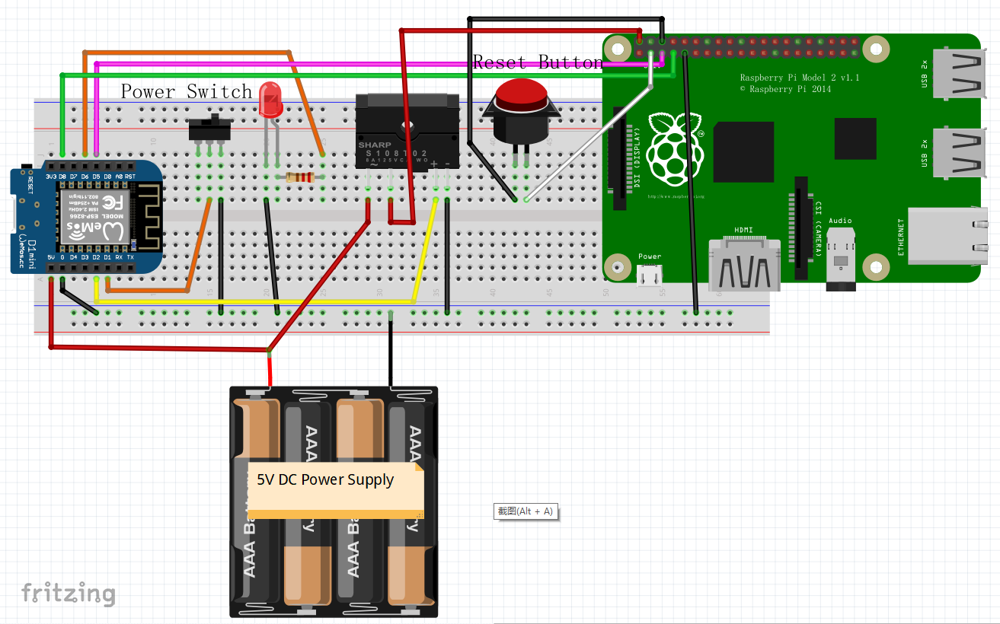

## The Purpose of this Project
[Recalbox](https://www.recalbox.com/) has done a great job bringing us a powerful yet easy-to-use emulator.  I have already made a bar top arcade
 with it and loved it a lot.
 
This time I'd like to retrofit a Nintendo Famicom (aka. NES) game console with a spared RPI2 and I want to make it
feel as authentic as possible, for example: the power on and off is handled by the original power switch,
and I don't need to worry about RPI being properly shutdown; also I can reset the game or quit the game to 
choose another one by pressing the original reset button, rather than using the combined key press on the gamepad
which is not the way how a real Famicom works.

So what I do is to use a spared WeMos D1mini (ESP8266) to handle the original power switch and SSR etc, and the ESP8266
will send signals to GPIOs on RPI to either reset/quit games or shutdown the Linux system safely, so that I won't
be bothered by the Recalbox menus, all the necessary operations are just like the good old days.


## Bill of Materials
* 1 x WeMos D1mini or other ESP8266 dev board
* 1 x RPI2 with [Recalbox](https://www.recalbox.com/) installed
* 1 x DC-DC Solid State Relay (make sure it can be triggered by 3V)
* 1 x 3mm Led
* 1 x 76Ω resistor
* 1 x Famicom console case with its original power switch and reset push button
* 1 x DC power supply of 5V 3A
* some wires...

## Prerequisites
#### Having Recalbox properly installed on your RPI
* Pls refer to [https://archive.recalbox.com/](https://archive.recalbox.com/)

#### Editing ```recalbox.conf```
* You can edit recalbox.conf through the browser by enter the IP address of the RPI,
 this will open the Recalbox manager.
* In recalbox.conf, add/uncomment the following line:
```system.power.switch=PIN356ONOFFRESET```
* You can find the corresponding Python script under folder:
```/recalbox/scripts/```
* Should you wish to change the Python script, enter ```mount -o remount,rw /``` first to make the partition writeable.
* By adding/uncommenting the above line, you can:
    1. Activate Linux shut down command by turn off a single throw switch, 
    which sends a low signal to RPI GPIO3.
    2. Reset a game (meaning return to start screen of the game) which you are playing,
    by short press (less than 1 sec) then release a push button, by which a low signal is sent to RPI GPIO2.
    3. Quit the game (meaning return to the emulator console) so that you can select another game,
    by long press (longer than 1 sec) then release a push button, by which a low signal is sent to RPI GPIO2.

#### Editing ```config.txt```
* You need to connect to the RPI by SSH.
* Enter ```mount -o remount,rw /boot``` before editing, otherwise the partition is read-only, and you won't be
able to save the change.
* You need to add/uncomment the following line in config.txt:
```enable_uart=1```
* By doing so, the RPI GPIO14 (UART0_TXD) is at high level when the RPI is on, and it will go low when the RPI is
properly shut down, which helps determine the power status of the RPI.

#### Preparing your ESP8266
* Download the firmware, pls see [here](http://micropython.org/download#esp8266)
* Flash the firmware, pls see [here](http://docs.micropython.org/en/latest/esp8266/esp8266/tutorial/intro.html#deploying-the-firmware)
* Transfer ```button.py``` & ```main.py``` in this repo to your ESP8266.  Here is a [tutorial](https://techtutorialsx.com/2017/06/04/esp32-esp8266-micropython-uploading-files-to-the-file-system/)


## Wiring
* Overview

| WeMos D1mini | RPI2 | Famicom | DC-DC SSR | LED | 5V DC Power Supply |
| :----------------: |:------:| :-----------------------: | :--------: | :--------------------:| :-----: |
| GPIO5 (D1)         |        |     Power SW +            |            |                       |         |
| GND                |   GND  | Power SW - & Reset BTN -  |  Input -   |   Cathode             |   GND   |
| GPIO4 (D2)         |        |                           |  Input +   |                       |         |
| GPIO16 (D0)        |  GPIO3 |                           |            |                       |         |
| GPIO14 (D5)        | GPIO14 |                           |            |                       |         |
| GPIO12 (D6)        |        |                           |            | Anode (/w a resistor) |         |
|                    |  GPIO2 |      Reset BTN +          |            |                       |         |
|  5V Pin            |        |                           |  Load +    |                       |   5V+   |   
|                    | 5V Pin |                           |  Load -    |                       |         |

* Fritzing Diagram



## Refs
* [Make a partition writable](https://github.com/recalbox/recalbox-os/wiki/Make-a-partition-writable-%28EN%29)
* [Edit the config.txt file](https://github.com/recalbox/recalbox-os/wiki/Edit-the-config.txt-file-%28EN%29)
* [recalbox.conf](https://github.com/recalbox/recalbox-os/wiki/recalbox.conf-%28EN%29)
* [Add a start stop button to your recalbox](https://github.com/recalbox/recalbox-os/wiki/Add-a-start-stop-button-to-your-recalbox-%28EN%29)
* [Emulator interactions via GPIO mapping](https://github.com/recalbox/recalbox-os/wiki/Emulator-interactions-via-GPIO-mapping-%28EN%29)
* [Rotary Encoder via GPIO](https://github.com/recalbox/recalbox-os/wiki/Rotary-Encoder-via-GPIO-%28EN%29)
* [RPI2 more power to usb ports](https://github.com/recalbox/recalbox-os/wiki/RPI2-more-power-to-usb-ports-%28EN%29)
* For more info, pls refer to Recalbox Wiki [Mini How To](https://github.com/recalbox/recalbox-os/wiki/Mini-How-To-%28EN%29)

